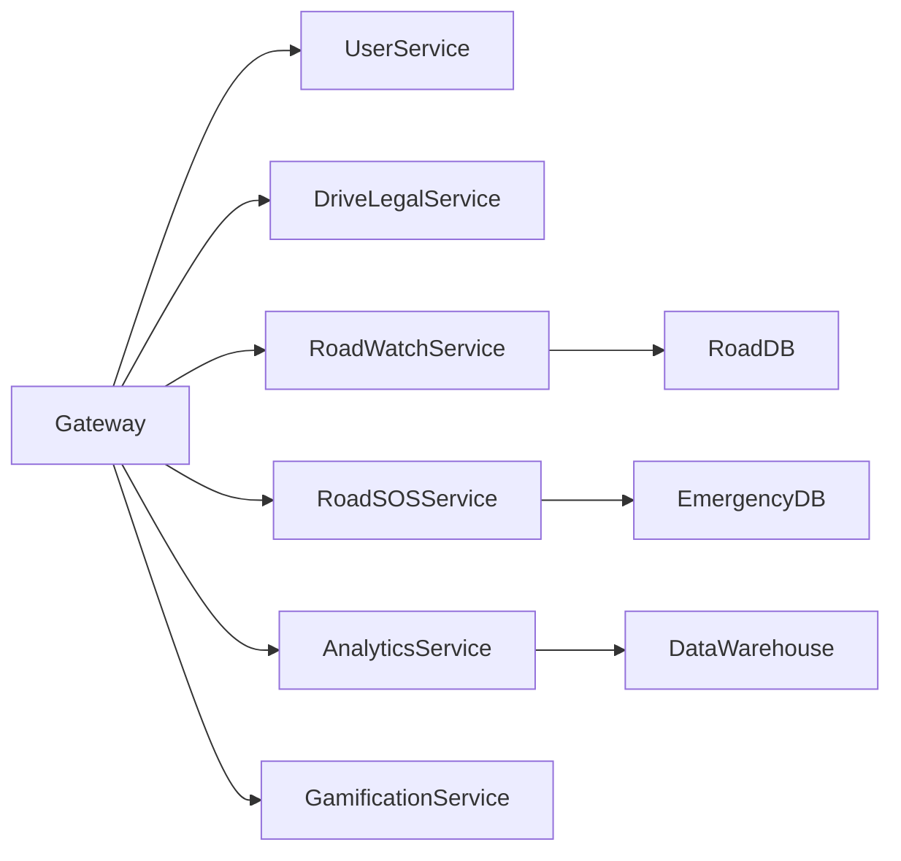
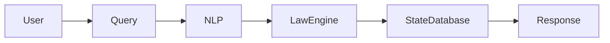
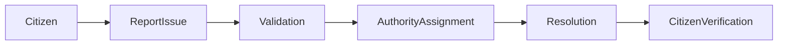
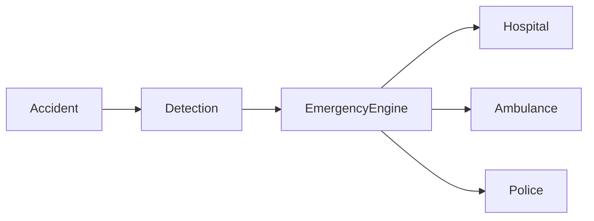
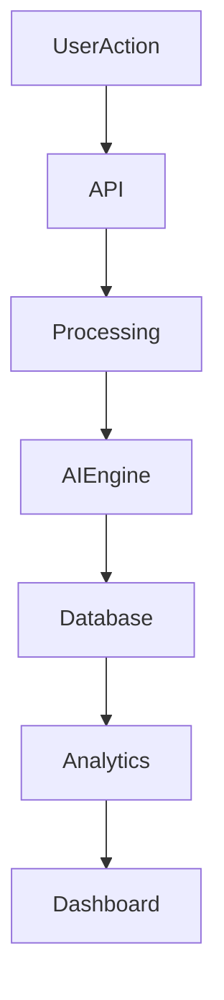

# ARCHITECTURE.md GENERATION PROMPT

Act as a Principal Solutions Architect from Microsoft Azure, AWS, Google Cloud, Palantir, and Tesla combined.

Generate an enterprise-grade ARCHITECTURE.md document for a platform called:

# SafeRoad AI

Tagline:
"AI-Powered Road Safety, Infrastructure Intelligence & Emergency Response Platform"

The document should feel like the architecture documentation of a national-scale smart city platform.

Use professional GitHub markdown.

Use Mermaid diagrams extensively.

Explain every architectural component in detail.

The document should be suitable for:

* Government Agencies
* Smart City Missions
* Investors
* Enterprise Clients
* Technical Architects
* Hackathon Judges

The architecture should be scalable to support:

* 100+ Million Citizens
* Multiple States
* Multiple Countries
* Millions of Daily Requests
* Real-Time Emergency Workloads

---

# COVER SECTION

Create a professional introduction.

Include:

Purpose of this document

Architecture goals

Scalability goals

Security goals

AI goals

Availability goals

---

# HIGH LEVEL SYSTEM ARCHITECTURE

Create a complete system architecture diagram.

```mermaid
graph TD

Users --> Frontend
Frontend --> API Gateway

API Gateway --> DriveLegal
API Gateway --> RoadWatch
API Gateway --> RoadSOS
API Gateway --> Analytics
API Gateway --> AIEngine

AIEngine --> NLPModels
AIEngine --> VisionModels
AIEngine --> PredictionModels

RoadWatch --> Database
RoadSOS --> Database
DriveLegal --> Database

Database --> Analytics
```

Explain every component.

---

# PLATFORM LAYERS

Create a dedicated section.

Explain:

## Presentation Layer

Includes:

* Web Application
* Mobile Application
* Admin Dashboard
* Government Dashboard

Responsibilities

Technologies

Benefits

---

## Application Layer

Includes:

* DriveLegal Service
* RoadWatch Service
* RoadSOS Service
* Analytics Service
* Gamification Service

Explain responsibilities.

---

## AI Intelligence Layer

Includes:

### NLP Engine

### Computer Vision Engine

### Prediction Engine

### Recommendation Engine

### Safety Scoring Engine

### Emergency Intelligence Engine

Explain:

Inputs

Processing

Outputs

---

## Data Layer

Explain:

PostgreSQL

MongoDB

Redis

Data Warehouse

Object Storage

Caching Layer

---

## Infrastructure Layer

Explain:

Cloud Architecture

Networking

Load Balancers

CDN

Containers

Kubernetes

Microservices

---

# MICROSERVICES ARCHITECTURE

Create a complete microservices diagram.



Explain each microservice.

---

# DRIVELEGAL ARCHITECTURE

Create a dedicated section.

Explain:

Traffic Law Database

State Rule Engine

Challan Calculator

OCR Engine

Legal AI Assistant

Workflow Diagram:



Explain every step.

---

# ROADWATCH ARCHITECTURE

Explain:

Road Monitoring Engine

Complaint Management System

Contractor Tracking System

Budget Transparency Engine

Road Health Engine

Workflow:



---

# ROADSOS ARCHITECTURE

Explain:

Emergency Engine

Hospital Locator

Ambulance Locator

Golden Hour Engine

Emergency Contact Service

Workflow:



---

# AI ARCHITECTURE

Create a complete AI architecture chapter.

---

## Natural Language Processing Layer

Models:

* Legal Assistant
* Citizen Assistant
* Emergency Assistant

Workflow Diagram

---

## Computer Vision Layer

Supports:

* Pothole Detection
* Crack Detection
* Road Damage Analysis
* Road Sign Recognition

Workflow Diagram

---

## Prediction Layer

Supports:

* Accident Prediction
* Risk Prediction
* Maintenance Prediction

Workflow Diagram

---

## Recommendation Layer

Supports:

* Safe Route Navigation
* Personalized Alerts
* Citizen Recommendations

Workflow Diagram

---

# DIGITAL TWIN ARCHITECTURE

Create a dedicated chapter.

Explain:

Data Sources

GIS Integration

Road Assets

Visualization Layer

Analytics Layer

Future Expansion

Create diagrams.

---

# GAMIFICATION ARCHITECTURE

Create architecture for:

Road Ranger Challenge

SafeDrive League

City Safety Wars

Safety Quest

Emergency Hero Simulator

Road Builder Challenge

Explain:

XP Engine

Reward Engine

Leaderboard Engine

Achievement Engine

Create flowcharts.

---

# DATA FLOW ARCHITECTURE

Create a detailed end-to-end data flow.



Explain every stage.

---

# DATABASE ARCHITECTURE

Create database design.

Entities:

Users

Roads

Complaints

Emergency Services

Cities

Contractors

Projects

Safety Scores

Achievements

Explain relationships.

Create ER-style diagrams.

---

# API ARCHITECTURE

Explain:

REST APIs

GraphQL APIs

WebSockets

Real-Time Services

API Gateway

Rate Limiting

Authentication

Authorization

Provide sample endpoints.

---

# CLOUD ARCHITECTURE

Create AWS/Azure/GCP architecture.

Include:

CDN

Load Balancer

Kubernetes

Microservices

Databases

AI Services

Monitoring

Backups

Create diagrams.

---

# SCALABILITY ARCHITECTURE

Explain how SafeRoad AI scales from:

10,000 users

100,000 users

1 million users

10 million users

100 million users

Explain horizontal scaling.

---

# SECURITY ARCHITECTURE

Create a complete chapter.

Include:

Identity Management

Authentication

RBAC

Encryption

API Security

Network Security

Audit Logging

Compliance

Threat Detection

Incident Response

Create security diagrams.

---

# OBSERVABILITY ARCHITECTURE

Explain:

Logging

Metrics

Monitoring

Tracing

Alerts

Dashboards

Error Tracking

Health Checks

---

# DISASTER RECOVERY ARCHITECTURE

Explain:

Backup Strategy

Multi-Region Deployment

Failover

Recovery Objectives

Business Continuity

---

# SMART CITY INTEGRATION ARCHITECTURE

Explain integration with:

Traffic Systems

CCTV

IoT Sensors

Emergency Control Rooms

Municipal Systems

Government APIs

---

# DEPLOYMENT ARCHITECTURE

Explain:

Development

Testing

Staging

Production

CI/CD Pipelines

GitHub Actions

Docker

Kubernetes

---

# PERFORMANCE TARGETS

Include:

API Response Time

AI Inference Time

Emergency Trigger Time

System Availability

Database Performance

Scalability Targets

---

# FUTURE ARCHITECTURE ROADMAP

Phase 1

Phase 2

Phase 3

Phase 4

Phase 5

Include future capabilities:

* Drone Integration
* Smart Traffic Signals
* Autonomous Vehicle Integration
* Vehicle-to-Infrastructure Communication
* National Command Centers

---

# CONCLUSION

End with a powerful statement positioning SafeRoad AI as a next-generation intelligent transportation and road safety operating platform capable of supporting national-scale deployments and smart-city ecosystems.
