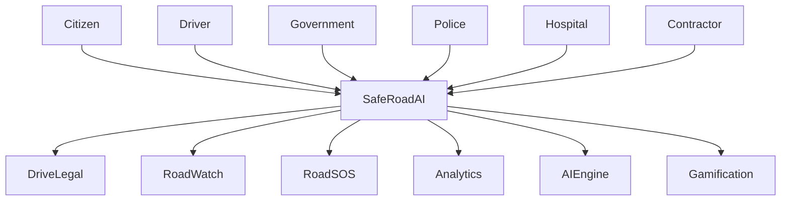
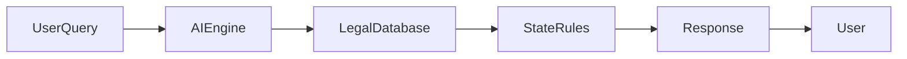
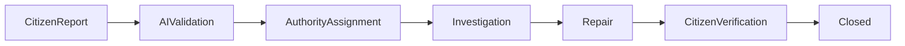
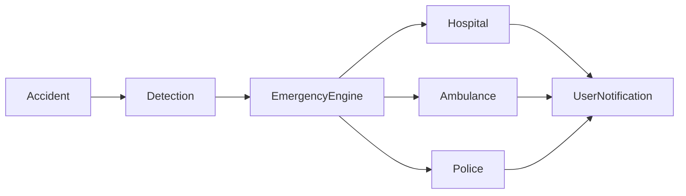
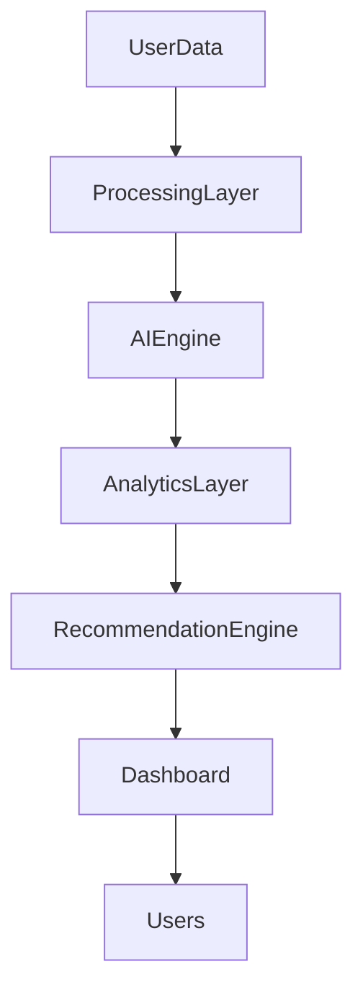

# 🚦 SafeRoad AI

### AI-Powered Road Safety, Infrastructure Intelligence & Emergency Response Platform

---

# 🌍 Vision

To build the world's most intelligent road safety ecosystem that combines Artificial Intelligence, infrastructure transparency, emergency response, predictive analytics, and citizen participation to create safer roads and smarter cities.

---

# 🎯 Mission

SafeRoad AI aims to transform how citizens, governments, emergency responders, and infrastructure authorities interact with transportation systems by providing a unified platform for road safety, legal compliance, infrastructure monitoring, and emergency assistance.

---

# 🚀 Executive Summary

Road accidents remain one of the leading causes of preventable deaths worldwide. Citizens often struggle with traffic regulations, infrastructure issues go unreported, emergency response is fragmented, and government agencies lack real-time road intelligence.

SafeRoad AI addresses these challenges through an integrated AI-powered platform consisting of:

* DriveLegal AI
* RoadWatch
* RoadSOS
* Safety Analytics Engine
* Predictive AI Systems
* Gamification Ecosystem

The platform enables proactive road safety management rather than reactive incident handling.

---

# 📊 Platform Snapshot

| Metric                | Value        |
| --------------------- | ------------ |
| Core Modules          | 4            |
| Advanced AI Engines   | 12+          |
| Gamification Systems  | 6            |
| Supported User Groups | 7            |
| Safety Features       | 25+          |
| Emergency Services    | 5+           |
| Deployment Scale      | National     |
| Architecture          | Cloud Native |

---

# 🏗 System Ecosystem

---

# 🎯 Problems Solved

## Legal Awareness

* Traffic law confusion
* State-specific regulation complexity
* Challan interpretation

## Infrastructure Transparency

* Potholes
* Delayed repairs
* Contractor accountability
* Budget opacity

## Emergency Response

* Delayed emergency access
* Lack of nearby service information
* Golden Hour inefficiencies

## Road Safety

* Accident-prone zones
* Unsafe routes
* Limited risk awareness

---

# 🧠 Core Modules

---

# 1️⃣ DriveLegal AI

AI-powered traffic law assistant.

## Features

* AI Legal Chatbot
* Challan Calculator
* State-wise Law Database
* Geo-fenced Regulations
* OCR Challan Scanner
* Driving License Guidance
* Voice-Based Queries
* Multilingual Support

## Workflow

## Benefits

* Faster legal awareness
* Reduced violations
* Improved compliance
* Simplified legal information

---

# 2️⃣ RoadWatch

Road infrastructure monitoring and transparency system.

## Features

* Pothole Reporting
* Repair Tracking
* Contractor Monitoring
* Budget Transparency
* Road Health Scores
* Citizen Verification
* Project Monitoring
* Infrastructure Analytics

## Complaint Lifecycle

## Benefits

* Improved accountability
* Faster repairs
* Public transparency
* Better infrastructure planning

---

# 3️⃣ RoadSOS

Emergency assistance and response platform.

## Features

* One-Tap SOS
* Nearby Hospitals
* Ambulance Finder
* Police Locator
* Golden Hour Mode
* Emergency Contacts
* Vehicle Rescue Network
* AI First Aid Assistant

## Emergency Flow

## Benefits

* Faster emergency response
* Improved survival rates
* Reduced confusion during emergencies

---

# 📈 Safety Analytics Engine

SafeRoad AI continuously calculates:

## Road Health Score

Measures:

* Surface Quality
* Maintenance Frequency
* Citizen Ratings

## Driver Safety Score

Measures:

* Speed Patterns
* Harsh Braking
* Driving Consistency

## City Safety Score

Measures:

* Accident Rates
* Complaint Resolution
* Emergency Efficiency

## Emergency Preparedness Score

Measures:

* Service Availability
* Response Time
* Resource Coverage

---

# 🤖 Advanced AI Ecosystem

---

## AI Accident Risk Predictor

### Inputs

* Historical accidents
* Road conditions
* Weather
* Traffic density

### Output

* Risk score
* High-risk alerts
* Prevention recommendations

---

## AI Pothole Scanner

Computer vision model detecting:

* Potholes
* Cracks
* Surface damage
* Waterlogging

---

## Safe Route Navigator

Instead of shortest routes, AI recommends:

* Safer roads
* Better lighting
* Better maintenance
* Lower accident probability

---

## Community Hazard Network

Citizens can report:

* Accidents
* Flooding
* Fallen trees
* Construction zones
* Dangerous roads

---

## Night Safety Score

AI calculates safety levels using:

* Lighting conditions
* Historical incidents
* Road quality
* Activity levels

---

## Blackspot Detector

Identifies accident hotspots using:

* Historical patterns
* Citizen reports
* Traffic flow
* Risk analytics

---

# 🌐 Digital Twin Platform

SafeRoad AI includes a Digital Twin layer that visualizes transportation infrastructure in a virtual environment.

### Capabilities

* Road Mapping
* Maintenance Tracking
* Infrastructure Monitoring
* Asset Management
* Planning Simulations

---

# 🎮 Gamification & Citizen Engagement Platform

SafeRoad AI turns road safety into a daily habit.

---

## Road Ranger Challenge

Users earn XP by:

* Reporting potholes
* Verifying repairs
* Completing missions
* Safety participation

### Progression

---

## SafeDrive League

Competitive safe-driving ecosystem.

### Leagues

* Bronze
* Silver
* Gold
* Platinum
* Diamond
* Road Master

---

## City Safety Wars

Cities compete through:

* Better safety scores
* Complaint resolution
* Citizen participation

---

## Safety Quest

Road safety learning adventure.

---

## Emergency Hero Simulator

Interactive emergency-response training.

---

## Road Builder Challenge

City-planning and infrastructure simulation.

---

# 🏛 Government Command Center

Provides:

* Live Complaints
* Road Health Dashboard
* Budget Monitoring
* Contractor Performance
* Emergency Statistics
* Accident Heatmaps
* AI Insights

---

# 🔄 Data Flow Architecture

---

# 🏗 Technology Stack

| Layer     | Technology                 |
| --------- | -------------------------- |
| Frontend  | React, Next.js, TypeScript |
| UI        | Tailwind CSS, ShadCN       |
| Backend   | Node.js, Express, FastAPI  |
| Database  | PostgreSQL, MongoDB        |
| AI        | OpenAI, Gemini, ML Models  |
| Maps      | Google Maps, OpenStreetMap |
| Analytics | Power BI, Superset         |
| Cloud     | AWS, Azure, GCP            |
| Security  | JWT, OAuth2, Encryption    |

---

# 🔐 Security Framework

## Authentication

* JWT
* OAuth2
* MFA Ready

## Authorization

* Role-Based Access Control

## Data Protection

* Encryption at Rest
* Encryption in Transit

## Compliance

* GDPR Ready
* Government Security Standards

---

# 👥 User Ecosystem

Supported users:

* Citizens
* Drivers
* Government Authorities
* Police Departments
* Hospitals
* Contractors
* Emergency Responders

---

# 🌆 Smart City Integration

SafeRoad AI integrates with:

* Traffic Management Systems
* CCTV Networks
* IoT Sensors
* Emergency Control Rooms
* Municipal Dashboards
* Smart City Platforms

---

# 📊 Impact Framework

Expected outcomes:

| Metric                  | Expected Improvement    |
| ----------------------- | ----------------------- |
| Accident Reduction      | 20–40%                  |
| Complaint Resolution    | 2x Faster               |
| Emergency Response      | 30–50% Faster           |
| Citizen Participation   | Significant Growth      |
| Road Quality Visibility | Nationwide Transparency |

---

# 🌍 UN Sustainable Development Goals Alignment

### SDG 3

Good Health & Well-Being

### SDG 9

Industry, Innovation & Infrastructure

### SDG 11

Sustainable Cities & Communities

### SDG 16

Peace, Justice & Strong Institutions

---

# 💼 Business Model

## Revenue Streams

* Government Licensing
* Smart City Deployments
* Analytics Platform
* Enterprise Dashboards
* API Marketplace
* Infrastructure Intelligence Services

---

# 🛣 Future Roadmap

### Phase 1

Core Platform Launch

### Phase 2

AI Infrastructure Intelligence

### Phase 3

Digital Twin Expansion

### Phase 4

National Command Center

### Phase 5

Global Smart City Integration

---

# 🤝 Contributing

We welcome contributions from:

* Developers
* Designers
* Researchers
* Road Safety Experts
* Government Innovation Teams

Please create an issue before submitting major feature requests.

---

# 📄 License

MIT License

---

# 🌟 Why SafeRoad AI?

SafeRoad AI is not simply:

❌ A complaint portal

❌ A traffic law application

❌ An emergency assistance tool

❌ A road monitoring dashboard

It is a complete **Road Safety Intelligence Platform** combining:

✅ Legal Intelligence

✅ Infrastructure Transparency

✅ Emergency Response

✅ Predictive Analytics

✅ Artificial Intelligence

✅ Community Participation

✅ Gamification

✅ Smart City Integration

✅ Government Decision Support

---

# Closing Statement

SafeRoad AI represents a future where road safety is proactive, infrastructure is transparent, emergency response is intelligent, and every citizen becomes an active participant in building safer communities. By combining Artificial Intelligence, predictive analytics, citizen engagement, and smart-city technologies, SafeRoad AI creates a scalable foundation for safer roads, smarter governance, and protected lives.
